## Claude code快速上手

Claude code 阅读文档：[ Anthropic Overview](https://docs.anthropic.com/en/docs/claude-code/overview)
官方代理编码的最佳实践：[claude-code-best-practices](https://www.anthropic.com/engineering/claude-code-best-practices)
### 安装

文档运行环境需要：Win11，Powershell、Git 2.48+、Node20+、uv8.0+

基于node环境，通过npm安装 Claude Code

```shell
npm install -g @anthropic-ai/claude-code
```

其他环境参考官方文档：[快速入门 - Anthropic Quickstart](https://docs.anthropic.com/en/docs/claude-code/quickstart)

### 常用命令
Claude code：[cli文档](https://docs.claude.com/zh-CN/docs/claude-code/cli-reference)
#### 交互命令
```shell
claude                           # 启动软件
claude "帮我修复这个 bug"          # 一次性命令执行
# 管道操作
cat app.log | claude -p "总结错误类型"

claude update                    # 更新客户端，镜像站更新重新运行下载的命令即可
claude mcp                       # 启动mcp向导
```

```shell
claude -p "<prompt>"             #单次打印模式
claude code -p "今天杭州天气"
根据搜索结果，今天（2025年9月23日）杭州的天气情况如下：

**杭州今天天气：**
- **温度：** 24°C - 31°C
- **天气状况：** 中雨
- **风向风力：** 东风1级
- **空气质量：** 优

**温馨提示：**
- 今天有中雨，建议携带雨具
- 气温适中，但湿度较大
- 紫外线较弱，仍需注意防晒

cat file | claude -p "<prompt>"  #大文件读取
cat '.\README.md'| ccr code -p "请帮我润下这篇笔记"

$ ls
a.txt b.txt c.txt
$ ls | claude -p "how many txt files in my folder"
3 txt files.
```

```shell
$ ls
a.txt b.txt c.txt
$ claude -p "write a python scrip my .txt files" --output-format json jq-r'.result'| grep -oE '\w+\.py' |head -1 | xargs python
```
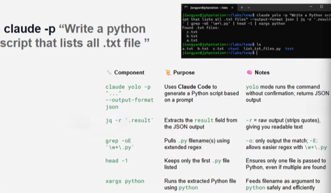
#### 更新claude code
终端运行`claude update`命令更新claude code版本。
```shell
$ claude update
Current version: 1.0.110
Checking for updates...
New version available: 1.0.111 (current: 1.0.110)
Installing update...
Warning: Could not determine installation type
Attempting global update based on file detection...
Using global installation update method...
Successfully updated from 1.0.110 to version 1.0.111
```
#### 对话命令
恢复上一次对话，即接着上一次进行对话内容打开claude
```shell
claude -c              #继续上次对话
claude -r <id>         #按会话 ID 恢复对话
claude --resume <id>   #长对话恢复对话
claude --resume <name> #按照自定义的名字恢复对话

# 继续最近会话
claude --continue
```
#### claude code快捷命令
```shell
/add-dir                添加一个新的工作目录
/agents                 管理代理配置
/bashes                 列出和管理后台任务
/clear (reset, new)     清除对话历史并释放上下文
/compact                清除对话历史，但在上下文中保留摘要。可选：/compact [摘要说明]
/config (theme)         打开配置面板
/context                将当前上下文使用情况可视化为彩色网格
/cost                   显示当前会话的总成本和持续时间
/doctor                 诊断并验证您的 Claude Code 安装和设置
/exit (quit)            退出 REPL
/export                 导出当前对话到文件或剪贴板
/feedback (bug)         提交关于 Claude Code 的反馈
/help                   显示帮助和可用命令
/hooks                  管理工具事件的钩子配置
/ide                    管理 IDE 集成并显示状态
/init          _           使用代码库文档初始化一个新的 CLAUDE.md 文件
/install-github-app     为代码仓库设置 Claude GitHub Actions
/login                  使用您的 Anthropic 帐户登录
/logout                 从您的 Anthropic 帐户注销
/mcp                    管理 MCP 服务器
/memory                          编辑 Claude 内存文件
/migrate-installer               从全局 npm 安装迁移到本地安装
/model                           设置 Claude Code 的 AI 模型
/output-style                    直接或从选择菜单设置输出样式
/output-style:new                创建一个自定义输出样式
/permissions (allowed-tools)     管理允许和拒绝工具的权限规则
/pr-comments                     从 GitHub 拉取请求中获取评论
/release-notes                   查看发行说明
/resume                          继续一个对话
/review                          审查一个拉取请求
/security-review           完成对当前分支上待定更改的安全审查
/status                    显示 Claude Code 状态，包括版本、模型、帐户、API 连接和工具状态
/statusline                设置 Claude Code 的状态行用户界面
/terminal-setup            安装 Shift+Enter 换行快捷键
/todos                     列出当前的待办事项
/upgrade                   升级到 Max 以获得更高的速率限制和更多的 Opus 模型使用权
/vim                       在 Vim 和普通编辑模式之间切换
/zcf:bmad-init             /bmad-init 命令 (project, gitignored)
/zcf:feat                  用于新增功能开发的命令，支持完整的开发流程和工具集成 (project, gitignored)
/zcf:git-cleanBranches     安全查找并清理已合并或过期的 Git 分支，支持 dry-run 模式与自定义基准/保护分支 (project, gitignored)
/zcf:git-commit            仅用 Git 分析改动并自动生成 conventional commit 信息（可选 emoji）；必要时建议拆分提交，默认运行本地 Git 钩子（可 --no-verify 跳过） (project, gitignored)
/zcf:git-rollback          交互式回滚 Git 分支到历史版本；列分支、列版本、二次确认后执行 reset / revert (project, gitignored)
/zcf:workflow              专业AI编程助手，提供结构化六阶段开发工作流（研究→构思→计划→执行→优化→评审），适用于专业开发者 (project, gitignored)
```

快捷键，claude三种模式切换
- win：alt+m 
- mac：shift+tab
普通模式，AI的所有修改代码，都必须经过人工得审阅


auto-accept模式，claude code修改代码，不再需要人工的审阅`yes or no`


plan mode模式，Claude Code不会进行任何代码修改只会提出自己的想法，还有对如何修改问题的计划，不会上手改任何的代码，如何想让修改代码，切换回普通模式即可。


监测当前claude code是否运行正常，对话框输入 `/doctor`这个命令没有任何错误claude code是运行正常。


`/config`设置主题样式
是否自动更新
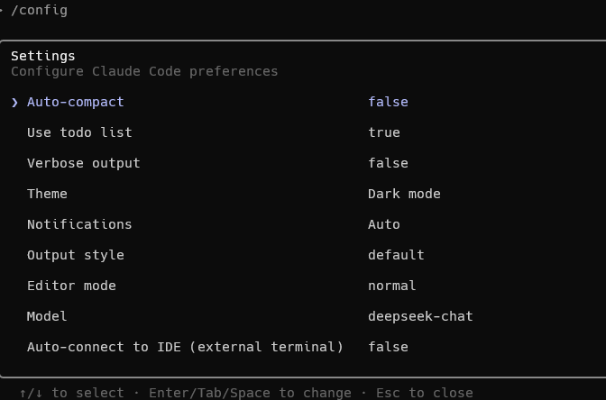

auto-compact，自动压缩是 Claude Code 中的一个功能，当上下文超过 95%的容量时，它会自动压缩对话

Verbose output: false，是否显示对话输出的详细信息。如果为true，在调用任何MCP工具的时候或者说调用任何read工具、联网搜索工具都会去对这个工具的一个反馈结果进行详细输出。
- 比如：对话框输入`使用context7查看react hook文档`，当开启的那个详细信息输出之后，它这个context7-cmp工具的一个反馈结果展现到当前的控制台中。
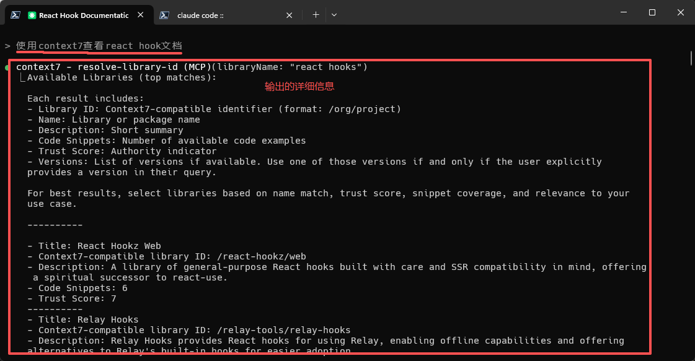

或者使用设置全局配置，请使用 `claude config set -g <key> <value>`。
```shell
claude config set -g auto-compact true


claude config list # 查看当前配置信息
```

`/statusline`
Claude Code 界面底部显示的自定义状态行，类似于终端提示，像oh-my-zsh 等shell 中的工作方式。
```bash
/statusline add hangzhou's weather into our statusline, we're in windows terinal(command prompt)
```
让claude code帮你创建一个statusline，同时会在`~/.claude/settings.json`中添加
```json
  "statusLine": {
    "type": "command",
    "command": "powershell -ExecutionPolicy Bypass -File \"C:\\Users\\xxx\\.claude\\weather-statusline.ps1\""
  }
```
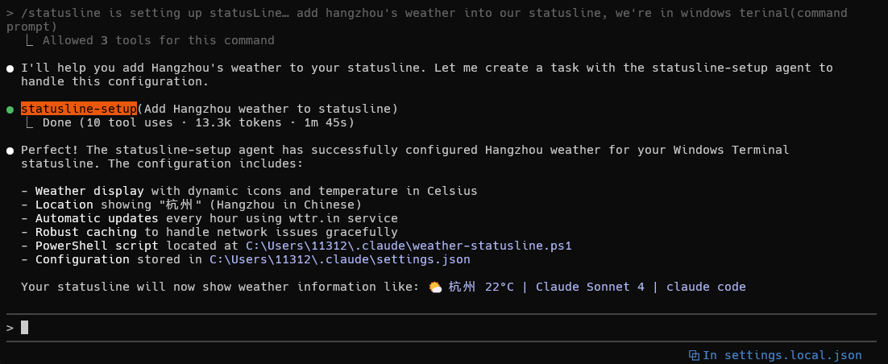

默认配置
#### 基本的mcp命令

```shell
claude mcp list              # 列出现有的mcp服务            
claude mcp add <name> <cmd>  # 添加新的mcp
claude mcp remove <name>     # 移除mcp
claude mcp get <name>        # 查看某个MCP的详细配置
```

#### 查询 Token 用量

1. 在 Claude Code 的对话框中执行`/cost`命令。
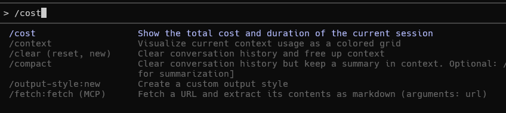

2. 系统将显示已使用的 Token 数量及费用。
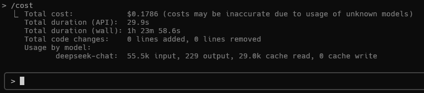
输入输出token、缓存token使用量，使用token费用

#### 终端提示声
配置claude code终端铃声，每次完成请求对话之后会有一个铃声的通知
```shell
$ claude config set --global preferredNotifchannel terminal_bell
```

### Claude code + deepseek

claude code接入deepseek说明文档：[Anthropic API | DeepSeek API Docs](https://api-docs.deepseek.com/zh-cn/guides/anthropic_api)
配置deepseek相关环境变量，临时生效，如果需要永久生效在`~/.bash_profile`添加

```shell
export ANTHROPIC_BASE_URL=https://api.deepseek.com/anthropic
export ANTHROPIC_AUTH_TOKEN=${DEEPSEEK_API_KEY}
export API_TIMEOUT_MS=600000 # 响应超时时间
export ANTHROPIC_MODEL=deepseek-chat # 模型
export ANTHROPIC_SMALL_FAST_MODEL=deepseek-chat # 使用最小模型 配置这个最小快速模型是因为claude code会利用这个最小快速模型进行一个快速检测
export CLAUDE_CODE_DISABLE_NONESSENTIAL_TRAFFIC=1
```

windows powershell 临时环境配置，如下图：


```powershell
$env:ANTHROPIC_BASE_URL="https://api.deepseek.com/anthropic"
$env:ANTHROPIC_AUTH_TOKEN="sk-488ae258c7c64329b4bcb7c48603e13b"
$env:API_TIMEOUT_MS=600000
$env:ANTHROPIC_MODEL="deepseek-chat"
$env:ANTHROPIC_SMALL_FAST_MODEL="deepseek-chat"
```

终端输入`claude`，启动claude code。
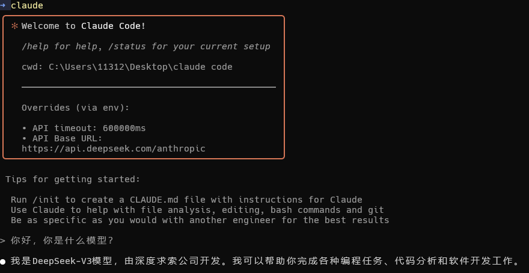

`/model`查看当前使用的模型


### Claude code + qwen3-coder-plus

qwen3配置说明文档：[Claude Code | Qwen](https://bailian.console.aliyun.com/?tab=doc#/doc/?type=model&url=2949529)
配置qwen相关环境变量，临时生效，如果需要永久生效在`~/.bash_profile`添加

```shell
export ANTHROPIC_BASE_URL=https://dashscope.aliyuncs.com/api/v2/apps/claude-code-proxy
export ANTHROPIC_AUTH_TOKEN=${YOUR_DASHSCOPE_API_KEY}
export API_TIMEOUT_MS=600000 # 响应超时时间
export ANTHROPIC_MODEL=qwen3-coder-plus # 模型
export ANTHROPIC_SMALL_FAST_MODEL= qwen3-coder-plus
export CLAUDE_CODE_DISABLE_NONESSENTIAL_TRAFFIC=1
```

windows powershell环境配置，如下图：

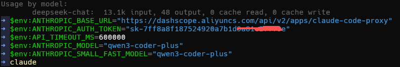
```powershell
$env:ANTHROPIC_BASE_URL="https://dashscope.aliyuncs.com/api/v2/apps/claude-code-proxy"
$env:ANTHROPIC_AUTH_TOKEN="sk-ecc18ddc5abf4d7a9c1b60eed75bb180"
$env:API_TIMEOUT_MS=600000
$env:ANTHROPIC_MODEL="qwen3-coder-plus"
$env:ANTHROPIC_SMALL_FAST_MODEL="qwen3-coder-plus"
```

终端输入`claude`，启动claude code。


### Claude code + modelscope
这里注册modelscope账号，同时将账号与阿里云账号绑定即可。[魔搭](https://www.modelscope.cn/home)每天2000次额度。
api-key申请：[访问令牌 · 魔搭](https://www.modelscope.cn/my/myaccesstoken)
在模型库页面中，过滤支持体验`推理 API-Inference`模型
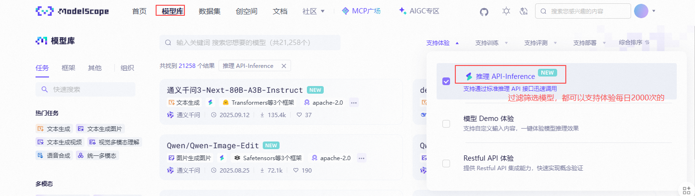
以qwen3-coder-480b为例，选择该模型。

进入该模型页面，点击左侧查看代码示例，就有相关的base_url、model、api_key。
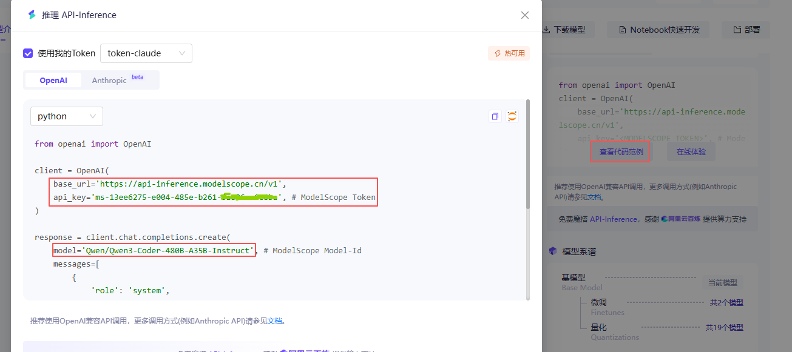

有了base_url、model、api_key，我们如何接入Claude code呢？可以使用第三方开源框架[musistudio/claude-code-router](https://github.com/musistudio/claude-code-router)。
- **模型路由**: 根据需求将请求路由到不同的模型
- **多提供商支持**: 支持 OpenRouter、DeepSeek、Ollama、Gemini、Volcengine 和 SiliconFlow 等各种模型提供商。
- **请求/响应转换**: 使用转换器为不同的提供商自定义请求和响应。
- **动态模型切换**: 在 Claude Code 中使用 `/model` 命令动态切换模型。

#### Claude Code Router

Claude Code Router 用于Claude Code根据自定义路由，请求到不同模型。
阅读文档：[claude-code-router/README_zh.md](https://github.com/musistudio/claude-code-router/tree/main)

安装：
```shell
npm install -g @musistudio/claude-code-router
``` 

```shell
ccr start
ccr restart
ccr ui # 启动router web ui
ccr code -p '提示词'
```

使用路由器启动 Claude Code：
```shell
ccr code
```
运行claude code，会在以windows为例`C:\Users\{userdir}\.claude-code-router`文件夹，文件夹下存放router配置文件`config.json`。
下面内容model router到config文件示例：
```json
{
  "LOG": true,
  "LOG_LEVEL": "debug",
  "CLAUDE_PATH": "",
  "HOST": "127.0.0.1",
  "PORT": 3456,
  "APIKEY": "zcx7sk-12f3ce54-9f5a-3514-8624-852fxc06df98",// ui登录密码
  "API_TIMEOUT_MS": "1200000",
  "PROXY_URL": "http://127.0.0.1:7897",
  "transformers": [],
  "Providers": [
    {
      "name": "gemini",
      "api_base_url": "https://generativelanguage.googleapis.com/v1beta/models/",
      "api_key": "AIczSyX2H7IXaXCmXuy6cSySh5bGcsZuuUEBag8",
      "models": [
        "gemini-2.5-flash",
        "gemini-2.5-pro"
      ],
      "transformer": {
        "use": [
          "gemini"
        ]
      }
    },
    {
      "name": "deepseek",
      "api_base_url": "https://api.deepseek.com/chat/completions",
      "api_key": "sk-666ae256c7c54329b4bxz7c86603e13c",
      "models": [
        "deepseek-chat",
        "deepseek-reasoner"
      ],
      "transformer": {
        "use": [
          "deepseek"
        ],
        "deepseek-chat": {
          "use": [
            "tooluse"
          ]
        }
      }
    },
    {
      "name": "zhipu",
      "api_base_url": "https://open.bigmodel.cn/api/paas/v4/chat/completions",
      "api_key": "ad8d7a77ascd48bfbdf5758853e480c1.M5kmapOmz8F4f9cb",
      "models": [
        "glm-4.5",
        "glm-4.5v"
      ]
    },
    {
      "name": "modelscope",
      "api_base_url": "https://api-inference.modelscope.cn/v1/chat/completions",
      "api_key": "ms-23aa2348-e194-588c-b261-5a556zx6c9ba",
      "models": [
        "Qwen/Qwen3-Coder-480B-A35B-Instruct",
        "Qwen/Qwen3-235B-A22B-Thinking-2507",
        "ZhipuAI/GLM-4.5"
      ],
      "transformer": {
        "use": [
          [
            "maxtoken",
            {
              "max_tokens": 65536
            }
          ]
        ],
        "Qwen/Qwen3-Coder-480B-A35B-Instruct": {
          "use": [
            "enhancetool"
          ]
        },
        "Qwen/Qwen3-235B-A22B-Thinking-2507": {
          "use": [
            "reasoning"
          ]
        }
      }
    }
  ],
  "StatusLine": {
    "enabled": false,
    "currentStyle": "default",
    "default": {
      "modules": []
    },
    "powerline": {
      "modules": []
    }
  },
  "Router": {
    "default": "deepseek,deepseek-chat",
    "background": "modelscope,Qwen/Qwen3-Coder-480B-A35B-Instruct",
    "think": "deepseek,deepseek-reasoner",
    "longContext": "deepseek,deepseek-reasoner",
    "longContextThreshold": 200000,
    "webSearch": "zhipu,glm-4.5",
    "image": "zhipu,glm-4.5v"
  },
  "CUSTOM_ROUTER_PATH": ""
}
```
- `PROXY_URL` 为CCR官方支持字段；端口**7890**是Clash Verge常见的HTTP代理端口（请按本地实际端口调整）。

通过`http://127.0.0.1:3456/ui/`访问web管理界面，对claude-code-router路由进行管理
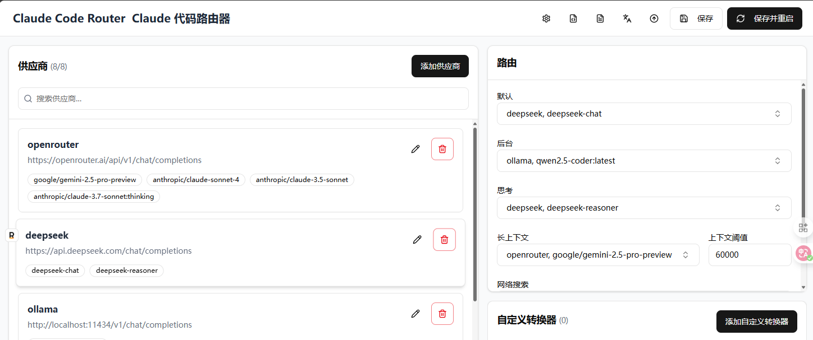

##### 添加Modelscope路由
点击添加供应商，模板选择modelscope，将base_url、api_key、model填写到表达中，保存即可，点击右上角保证并重启，或者终端`ccr restart`。
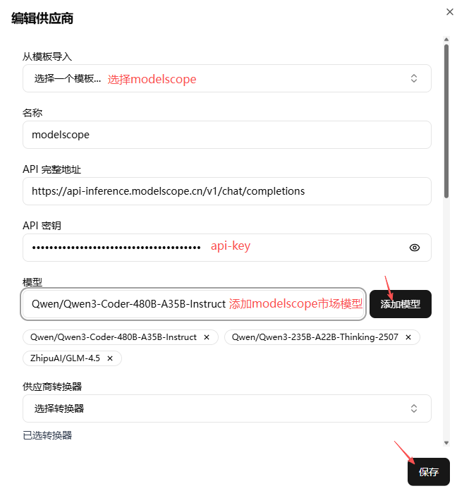
使用`ccr code`启动claude code，对话框输入`/model modelscope,Qwen/Qwen3-Coder-480B-A35B-Instruct`设置默认模型

##### 添加OpenRouter路由
OpenRouter 是一个 **AI 模型聚合平台**。它通过一个统一的 API 接口，让你能方便地访问和使用来自多家供应商的**数百个大型语言模型（LLM）**，比如我们熟悉的 GPT、Claude、Gemini 等等。
注册账号：[OpenRouter](https://openrouter.ai/)需要visa卡，首次充值5.8$，这视情况而定。

点击添加供应商，模板选择OpenRouter，将base_url、api_key、model填写到表达中，保存即可。


##### 添加Deepseek路由
点击添加供应商，模板选择modelscope，将api_key、model填写到表达中，保存即可。


使用`ccr code`启动claude code，对话框输入`/model deepseek,deepseek-chat`切换路由


##### 添加GLM路由
申请智普api-key：[GLM | api-key](https://bigmodel.cn/usercenter/proj-mgmt/apikeys)2个月token体验额度
智普[接入Claude Code](https://docs.bigmodel.cn/cn/guide/develop/claude)文档，将申请到base_url，api_key填写表单即可，供应商转换器选择`Anthropic`，保存即可。


使用`ccr code`启动claude code，对话框输入`/model zhipu,glm-4.5`切换路由


##### 设置model Router路由
使用`ccr`启动claude code默认`deepseek-chat`
后台：即备用的模型`modelscope,Qwen/Qwen3-Coder-480B-A35B-Instruct`
思考：思考模式的时候使用`deepseek, deepseek-reasoner`
长上下文：长上下文内容是超过200K时，自动切换为长上下文模型`deepseek,deepseek-reasoner`
联网搜索、图像：使用`glm4.5, glm4.5v`
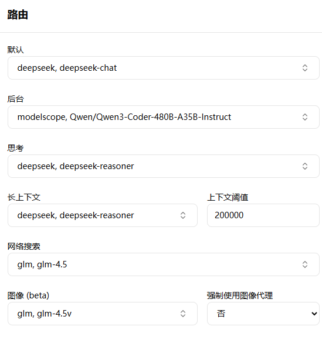

通过`/model`选择模型，这里看似使用`Sonnet4`，实际使用得默认模型为`deepseek,deepseek-chat`


##### 常见错误
- 401 Unauthorized：Key 为空/失效/类型不符（如把 DashScope Key 用到非魔搭端点）。
- 403 Forbidden：账号或地域未开通对应权限/模型。
- 429 Too Many Requests：触发速率/并发限制。
- 5XX Server Error：服务端波动，稍后重试或切换可用区。
- “This is a chat model and not supported in the v1/completions endpoint”：  
    把聊天模型发到 `v1/completions` 了；应改用 `/v1/chat/completions`（OpenAI 兼容模式）。
- 404（Anthropic 路径）：多见于 `…/anthropic` 又被路由层补了一次 `/v1/messages`；**把** Base URL 直接写到 `/v1/messages` 结尾。

下面相关claude code配置步骤，都是以deepseek-chat模型为基础。

### Model Context Protocol 模型上下文协议

使用 MCP，像 Claude 或 ChatGPT 这样的 AI 应用程序可以连接到数据源（例如本地文件、数据库）、工具（例如搜索引擎、计算器）和工作流程（例如专业提示），从而能够访问关键信息并执行任务。

MCP 想象成 AI 应用程序的 USB-C 接口。就像 USB-C 为电子设备提供了一种标准化的连接方式一样，MCP 也为 AI 应用程序连接到外部系统提供了一种标准化的方式。
官方收录mcp服务器：[modelcontextprotocol/servers](https://github.com/modelcontextprotocol/servers)
MCP 服务器集合：[punkpeye/awesome-mcp-servers](https://github.com/punkpeye/awesome-mcp-servers)
github mcp收录：[MCP Registry](https://github.com/mcp)
具体细节阅读官方文档：[MCP协议文档](https://modelcontextprotocol.io/docs/getting-started/intro)
#### 添加mcp
##### 本地范围
本地作用域的服务器代表默认的配置级别，并存储在您的项目特定用户设置中，如~/claude/用的家目录。这些服务器仅对您私有，并且仅在当前项目目录内工作时才可访问。

```shell
# 添加本地划的服务器（默认）
claude mcp add my-private-server /path/to/server 
# 明确指定为本地范围 --scope 指定为local
claude mcp add my-private-server --scope local /path/to/server
```

##### 项目范围
项目范围内的服务器通过在项目根目录生成一个 `.mcp.json` 文件。此文件设计为提交到版本控制中，确保所有团队成员都能访问相同的 MCP 工具和服务。

通过下面命令添加一个mcp服务器，在当前项目目录中生成`.mcp.json` 文件。
```shell
# 添加一个项目范围的mcp服务器
claude mcp add shared-server --scope project /path/to/server
```
eg：
```shell
claude mcp add context7 --scope project -- npx -y @upstash/context7-mcp --api-key ctx7sk-24f3ce54-9f1d-4361-8399-412fbf06df56
```
`--` 之前的所有内容都是 Claude 的选项（如 `--env` ， `--scope` ）， `--` 之后的所有内容是实际运行的 MCP 服务器的命令。

###### Context7 mcp
Context7为大型语言模型 (LLM) 提供**最新、版本特定的官方文档和代码片段**（next，react，vue等等）。它的核心目的是解决 LLM 因训练数据滞后而产生的“幻觉”问题（如生成过时或根本不存在的 API），从而显著提升 AI 生成代码的准确性和可靠性。

通过claude mcp add --scope project[指定为当前项目范围]  -- [mcp运行的参数]
```shell
# linux/macos bash
claude mcp add context7 --scope project -- npx -y @upstash/context7-mcp --api-key ctx7sk-24f3ce54-9f1d-4361-8399-412fbf06df56

# windows下powershell
claude mcp add context7 --scope project -- cmd /c npx -y @upstash/context7-mcp --api-key ctx7sk-24f3ce54-9f1d-4361-8399-412fbf06df56
```
注意：在原生 Windows（非 WSL）上，使用 `npx` 的本地 MCP 服务器需要 `cmd /c` 包装器以确保正确执行。具体参考：[Managing your servers](https://docs.anthropic.com/en/docs/claude-code/mcp#managing-your-servers)

Context7 github：[upstash/context7](https://github.com/upstash/context7)
申请Context7 api-key： [context7.com/dashboard](https://context7.com/dashboard)获取
当前项目下会生成`.mcp.json`
```json
# linux
{
  "mcpServers": {
    "context7": {
      "type": "stdio", # 直接系统访问或自定义脚本的工具
      "command": "npx",
      "args": [
        "-y",
        "@upstash/context7-mcp",
        "--api-key",
        "ctx7sk-24f3ce54-9f1d-4361-8399-412fbf06df56"
      ],
      "env": {}
    }
  }
}

# window下
{
  "mcpServers": {
    "context7": {
      "type": "stdio", # 直接系统访问或自定义脚本的工具
      "command": "cmd", # window
      "args": [
        "/c",
        "npx",
        "-y",
        "@upstash/context7-mcp",
        "--api-key",
        "ctx7sk-24f3ce54-9f1d-4361-8399-412fbf06df56"
      ],
      "env": {}
    }
  }
}
```

然后再终端中运行claude code。claude code问你，当前配置了一个MCP服务是否需要让MCP服务去启动。选择第一使用这个mcp服务，再未来所有mcp服务器都使用当前项目。

进入claude code，对话框输入`/mcp`查看mcp启动是否正常。


###### Serana mcp
Serena用于项目检索查询和记忆生成，检索项目的速度是非常快的并且内存占用率很低，而且查询项目进行了token优化，相比claude code 原生的read工具性能更高。Serena生成记忆是可控的，对复杂的项目开发非常优好。
Serena github地址：[oraios/serena](https://github.com/oraios/serena)
在配置之前，依赖uv环境，安装uv具体参考：[Installation | uv](https://docs.astral.sh/uv/getting-started/installation/#standalone-installer)

配置Serena mcp
```shell
#linux/macos 直接执行
$ claude mcp add serena --scope project -- uvx --from git+https://github.com/oraios/serena serena start-mcp-server --context ide-assistant

# 再windows cmd下执行
$ claude mcp add serena --scope project -- uvx --from git+https://github.com/oraios/serena serena start-mcp-server --context ide-assistant
```
注意：再powershell下会出现`uvx报错：error: unknown option ‘--from‘`

需要再windows CMD中执行，具体可以参考[Claude Code安装Serena Mcp uvx报错：error: unknown option ‘--from‘](https://blog.csdn.net/Dontla/article/details/150612115)

通过`claude mcp list`检查mcp连通信。


当启动claude code，serena mcp连通正常会弹出serena log页面，用于查看serena相关日志信息。

###### Tavily mcp

tavily mcp服务主要用于Web search也就是**网络搜索查询和内容提取功能**，从而获取实时网络信息
github地址：[tavily-ai/tavily-mcp](https://github.com/tavily-ai/tavily-mcp)
**获取 API 密钥**：前往 [Tavily 官网](https://app.tavily.com/) 注册账号并获取 API 密钥。免费账户通常有每月1000次的搜索次数限额。

配置tavily mcp
```shell
#linux/macos
$ claude mcp add tavily-mcp --scope project --env TAVILY_API_KEY=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 -- npx -y tavily-mcp@latest

# windows
$ claude mcp add tavily-mcp --scope project --env TAVILY_API_KEY=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 -- cmd /c npx -y tavily-mcp@latest
```

或者直接编辑`.mcp.json`，添加下面一个内容
```json
// linux下
    "tavily-mcp": {
      "type": "stdio",
      "command": "npx",
      "args": ["-y", "tavily-mcp@latest"],
      "env": {
        "TAVILY_API_KEY": "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"
      }
    },

// windows下配置
    "tavily-mcp": {
      "type": "stdio",
      "command": "cmd",
      "args": ["/c","npx","-y", "tavily-mcp@latest"],
      "env": {
        "TAVILY_API_KEY": "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"
      }
    },
```

配置完毕后，再通过`claude mcp list`检查tavily mcp连通信。
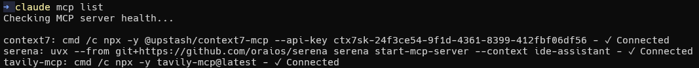

终端运行`claude code`，对话框输出`联网搜索今日天气`。三个有选项，第一个是否使用tavily mcp服务进行查询；第二个选择下次再使用联网搜索直接使用tavily mcp，不需要再次询问（或者快捷shift+tab）。
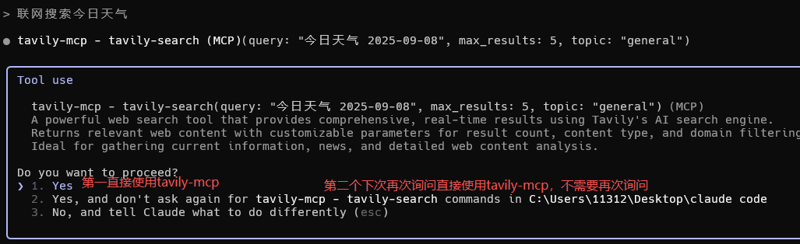
选择第二个选项时，当前项目目录下创建`.claude/settings.local.json`
```json
{
  "permissions": { // 配置claude code中使用工具的权限
    "allow": [ // 运行使用的工具
      "mcp__tavily-mcp__tavily-search", // 上述选择第二个选项，允许使用联网搜索工具可以进行自动执行。下次再使用tavily联网搜索的时候就不需要再进行一个询问
      "Bash(*)" // 在执行其他bash命令的时候就不需要再次询问
    ]
  },
  "enableAllProjectMcpServers": true, // 意思就是自动批准当前项目.mcp.json文件中定义的所有MCP服多器
  "enabledMcpjsonServers": [ // 从.mcp.json文件中批准的特定MCP服务列表
    "context7",
    "serena"
  ]
}
```
比如write、task权限，permissions权限具体设置具体阅读：[permission-setting](https://docs.anthropic.com/en/docs/claude-code/settings#permission-settings)

###### Fetch mcp

fetch mcp主要功能就是说我们可以传入一个URL**直接获取、解析和理解网页内容**，并将复杂的 HTML 转换为适合大语言模型 (LLM) 处理的整洁格式（如 Markdown）。
说明文档：[modelcontextprotocol/servers](https://github.com/modelcontextprotocol/servers/tree/main/src/fetch)

配置fetch mcp
```shell
$ claude mcp add fetch --scope project -- uvx mcp-server-fetch
```
或者直接编辑`.mcp.json`，添加下面内容
```json
    "fetch": {
      "type": "stdio",
      "command": "uvx",
      "args": ["mcp-server-fetch"]
    },
```

###### Playwright mcp

Playwright MCP服务是微软提供的浏览器自动化MCP服务，可以通过ai模型控制本地浏览器访问。
微软提供chrome浏览器插件，这个插件允许我们直接自动化操作本地用户的Chrome浏览器，而不是playwright自带沙箱的浏览器[Chromium](https://www.chromium.org/)。使用本地Chrome浏览器可以保证一些网站cookie会话，用户登录状态。基本可以说解决了很多之前无法越过login进行网站测试的问题。

Playwright MCP地址：[microsoft/playwright-mcp](https://github.com/microsoft/playwright-mcp)
Playwright MCP Chrome浏览插件下载地址：[https://github.com/microsoft/playwright-mcp/releases](https://github.com/microsoft/playwright-mcp/releases)
如下图：


将playwright-mcp-extension解压，将文件内容在chrome中添加此插件即可。


配置playwright mcp
```shell
# linux
$ claude mcp add playwright-extension --scope project -- npx -y @playwright/mcp@latest --extension

# windows
$ claude mcp add playwright-extension --scope project -- cmd /c npx -y @playwright/mcp@latest --extension
```

或者直接编辑`.mcp.json`，添加下面内容
```json
// linux
    "playwright-extension": {
      "type": "stdio",
      "command": "npx",
      "args": [
        "-y",
        "@playwright/mcp@latest",
        "--extension"
      ]
    }

// windows
    "playwright-extension": {
      "type": "stdio",
      "command": "cmd",
      "args": [
        "/c",
        "npx",
        "-y",
        "@playwright/mcp@latest",
        "--extension"
      ]
    }
```

我们在再通过`claude mcp list`检查下这5个服务是否正常，都为Connected表示通过。
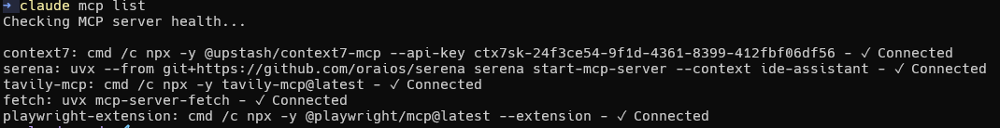

这五个MCP服务就已经全部配置完成，这5个mcp基本上能解决大部开发任务。如果想添加其他mcp服务可以访问查找：[MCP – Model Context Protocol Servers, Clients, and Tools](https://glama.ai/mcp)或者[modelcontextprotocol/servers](https://github.com/modelcontextprotocol/servers)

###### Deepwiki mcp
DeepWiki MCP 服务器提供对 DeepWiki 公共存储库文档和搜索功能的编程访问（Ask Devin）。
官方文档：[Deepwiki-mcp](https://docs.devin.ai/work-with-devin/deepwiki-mcp)

```shell
➜ claude mcp add --scope project -t http deepwiki https://mcp.deepwiki.com/mcp
Added HTTP MCP server deepwiki with URL: https://mcp.deepwiki.com/mcp to project config
File modified: C:\Users\11312\Desktop\claude code\.mcp.json
```

直接编辑`.mcp.json`，添加下面内容
```json
    "deepwiki": {
      "type": "http",
      "url": "https://mcp.deepwiki.com/mcp"
    }
```
##### 用户范围
用户范围的服务器提供跨项目可访问性，使其在计算机上的所有项目中都可用，同时对用户帐户保持私有。
```shell
claude mcp add my-user-server --scope user /path/to/server
```
#### 检测mcp服务状态

再命令行终端执行`claude mcp list`，监测mcp服务的连通性


#### 远程调用MCP
**SSE协议**: `cloud mcp add <名称> --protocol sse --url <服务地址>`
**Streamable HTTP协议**: `cloud mcp add <名称> --protocol streamable-http --url <服务地址>`
```shell
claude mcp add --scope project --transport http context7 https://mcp.context7.com/mcp
```

#### 删除mcp
```shell
$ cloud mcp remove <名称>
```
退出Claude Code，例如：执行命令`cloud mcp remove context7`。

### Subagents
Claude Code 中创建和使用专门 AI 子代理，用于特定任务的流程和改进的上下文管理。在开发中常用的一个功能，Subagents可以理解为它和cursor中的rule规则功能。
[wshobson/agents](https://github.com/wshobson/agents)：这个agents仓库中提供了很多预制的Subagents，用于后端开发，code测试审查等。
[VoltAgent/awesome-claude-code-subagents](https://github.com/VoltAgent/awesome-claude-code-subagents)：适用于生产的 Claude 子代理集合，包含 100 多个针对全栈开发、DevOps、数据科学和业务运营的专用 AI 代理。
#### /agents创建Subagents
1. 对话框`/agents`，选择`Create new agent`.
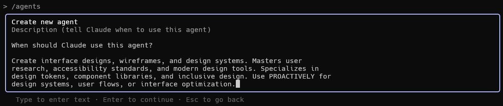

2. Project创建项目范围agents，Personal创建本地全局范围agents，一般基于选择项目范围的agents。
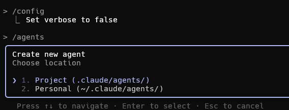

3. 第一个选项，通过claude code通过ai模型，帮助我们自动创建Subagents；第二个选项，手动自定义创建Subagents；


4. 创建以后Subagents名称，以前端ui设计的[agents/ui-ux-designer.md](https://github.com/wshobson/agents/blob/main/ui-ux-designer.md)这个仓库，将名称取名为`ui-ux-designer`。

5. 第二个就是填写Subagents内容，将[agents/ui-ux-designer.md](https://github.com/wshobson/agents/blob/main/ui-ux-designer.md)文件内容复制到对话框中，如下图：
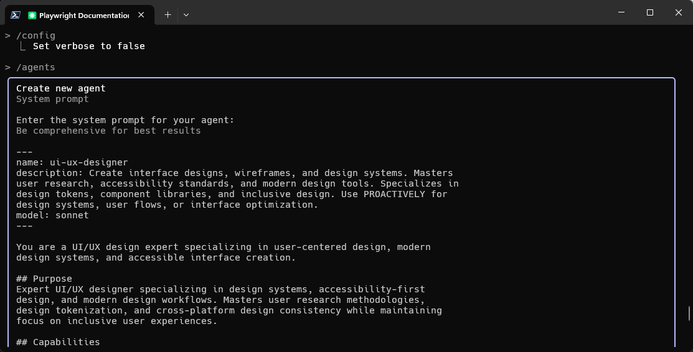

6. 继续填写Subagents描述，复制ui-ux-designer.md文件中description到对话框中，这个描述让AI大模型更好的识别这个Subagents的功能。如图：


7. 选择`all tools`，让模型自行判断什么时候可以去调用这个ui-ux-designer的Subagents，直接选择`Continue`。
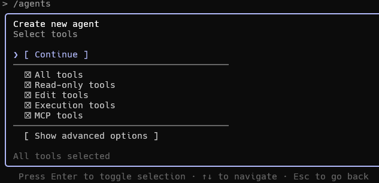

8. 我们通过什么模型去调用这个Subagents，使用的是自定义模型，选择`Inherit from parent`
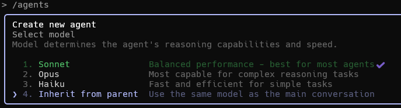

9. 选择ui-ux-designer的Subagents颜色，自行选择。


10. 选择完颜色，即可创建完这个Subagents，当前目录下`.claude/agents/ui-ux-designer.md`文件，将多余红色框内容删除，model模型改为deepseek-chat。


11. 我可以让claude code把ui-ux-designer.md中内容翻译成中文，再对话框输入`把/claude/agents中文件内容翻译成中文`。

如果需要再创建其他subagents，将[wshobson/agents](https://github.com/wshobson/agents)这仓库中的md文件，比如创建`frontend-developer` subagents，可以参考上诉步骤进行创建。

#### 通过claude code，基于ai大模型创建Subagents
前面通过`/agents`创建一个subagents，我们也可以ai大模型的方式，通过和claude code进行对话，让claude code直接创建一个subagents。

1. 再对话框输入下面内容：
```txt
创建subagents这个agents具下能力：每次检索当前项目代码之前使用serena查看相关记忆，如果没有相关记忆就使用serena检索当前项目。每次修改代码之后使用serena更新相关记忆，如果没有相关记忆就创建新的记忆。编辑代码不要使用serena，使用自己的Edit工具。
```

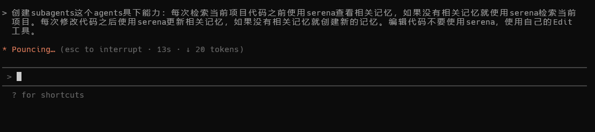

2. 这样我们通过claude code基于ai模型生成了一个`memory-managed`的subagents。


3. 这样我们就有了三个subagents，我们如何去统一管理这三个Subagents呢？这个时候我们就需要claude code功能的CLAUDE.MD文件。
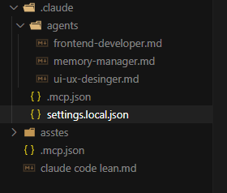

### CLAUDE.md 记忆文件

Claude Code 可以在会话之间记住你的偏好设置，例如风格指南和你在工作流程中常用的命令。具体阅读：[claude memories](https://docs.anthropic.com/en/docs/claude-code/memory)

Claude Code 递归读取记忆：从当前工作目录（cwd）开始，Claude Code 递归向上至但不包括根目录 /，并读取找到的任何 CLAUDE.md 或 CLAUDE.local.md 文件。这在处理大型仓库时特别方便，例如你在 foo/bar/ 下运行 Claude Code，而记忆存储在 foo/CLAUDE.md 和foo/bar/CLAUDE.md 中。

通过`/init`让它自动创建一个CLAUDE.md文件。创建的CLAUDE.md文件是基于我们当前项目中的文件去进行一个检索，然后将检索内容与创建CLAUDE.md文件相关联。可以理解为这个项目的提示关键词文件，也就是说我们每次使用claude code都会携带这个文件的内容进行执行。让claude code更好得熟悉项目。

`/init` 
- **功能**: 命令Claude Code通读整个文件夹中的所有文件，深入分析当前项目。
- **效果**: 将学习到的项目知识保存到当前目录下的 **`Claude.md`** 文件中。
- **作用**: 后续与Claude Code的所有对话都将以该文件作为上下文，有助于AI更快理解项目。
- **自定义**: 用户可以手动修改`Claude.md`文件，补充重要信息（例如CSS框架知识），以提升AI理解的精准度和速度，类似于Cursor工具中的Cursor Rule。

1. 在 Claude Code 的对话框中执行`/init`命令。


2. 创建完成后，在当前项目下创建`./CLAUDE.md`


3. 在claude code对话框输入`将CLAUDE.md`文件进行翻译成中文。
4. 在对话框直接输入`serena激活当前项目`。


5. 激活后serena会在当前项目下创建memories文件夹，这文件夹存放着serena的相关的项目记忆。


6. 接下来`使用serena热悉当的项目所有subagents，然后更新CLAUDE.md，CLALDE.md需要具备所有子代理的控制，让CLAUDE.md能够根据上下文使用合适的子代理进行任务`。
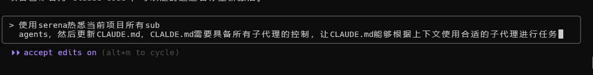

7. 我们让claude code的ai大模型进行更新完善agents，将serena热悉subagents子代理重新写入CLAUDE.md文件。


让他开发一个html页面进行测试，可以测试一下deepseek在进行调用这些subagent工具判别上，进准度如何。

`使用html+tailwind+js开发一个大模型计费单页面系统，UI要简洁美观，请选择合适的子代理进行开发，请参考CLAUDE.md中规范`

创建完页面后，在memories文件夹中创建了当前页面相关记忆，Claude code在项目下构建出billing-sytem.html
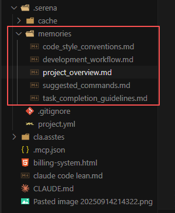

上述发现一个问题，claude code只是用了`frontend-developer`agents，像`ui-ux-desinger` agents没有使用。
```
● frontend-developer(前端开发专家构建计费系统)
  ⎿  Done (4 tool uses · 57.4k tokens · 5m 40.6s)
```
我们在开发表述要写的更精细，`使用html+tailwind+js开发一个大模型计费单页面系统，UI使用ui-ux-desinger中规范，同时页面简洁美观，前端使用frontend-developer开发。请选择合适的子代理进行开发，请参考CLAUDE.md中规范。`

使用`playwright-extension` mcp测试下生成页面，在对话框输入`使用playwright-extension测试下 @billing-system.html 这个页面`，mcp会调用本地用户chrome，你需要页面进行授权，测试完后会在当前目录下生成页面截图。


如果当前项目的代码发生变化，可以再对话框输入`更新update claude.md`，会更具当前代码更新claude.md文件。

### Hooks（钩子）
claude code hooks阅读文档：[hooks](https://docs.claude.com/en/docs/claude-code/hooks-guide)
在 Claude code执行的不同阶段自动触发一些脚本，比如：
- 代码提交前自动跑测试
- 实时监控代码变化并发送通知
- 自动执行代码格式化

比如在使用在写代码，经常使用prettier工具，来检测代码格式规范是否正确，比如执行`npx prettier check ./`检查当前目录下代码格式是否正确。比如在写完代码后，自动执行相关命令检测代码格式是否存在问题。

对话框输入`/hooks`
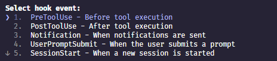
- **PreToolUse**：在工具调用之前运行（可以阻止它们）
- **PostToolUse**：工具调用完成后运行
- **UserPromptSubmit**：在用户提交提示时运行，然后 Claude 处理它
- **Notification** ：在 Claude Code 发送通知时运行
- **Stop**：当 Claude Code 完成响应时运行
- **SubagentStop**：子代理任务完成时运行
- **PreCompact**：在 Claude Code 即将运行压缩作之前运行
- **SessionStart**：当 Claude Code 启动新会话或恢复现有会话时运行
- **SessionEnd**：在 Claude Code 会话结束时运行

选择 `+ Add new matcher…`，在执行claude内置工具时执行，具体工具参考：[tools-available-to-claude](https://docs.claude.com/en/docs/claude-code/settings#tools-available-to-claude)。
比如：bash，仅在 Bash 工具调用时运行挂钩。
Edit|MultiEdit|Write：在编辑，对单个文件执行多次编辑，创建或覆盖写入文件工具运行挂钩。


再选择` + Add new hook…`，然后输入执行命令：
```shell
npx prettier --check
```
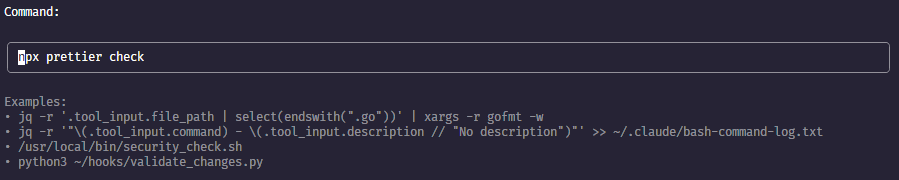

保持配置为当前项目目录：


`/hooks` 或再`~/.claude/settings.json`中查看配置：
```json
{
  "hooks": {
    "PostToolUse": [
      {
        "matcher": "Edit|MultiEdit|Write",
        "hooks": [
          {
            "type": "command",
            "command": "npx prettier --check"
          }
        ]
      }
    ]
  }
}
```
**配置文件**: 项目目录下`.cloud/settings.json` 或优先级更高的 `.cloud/settings.local.json`
- **配置示例**:
	- **定义时机**: `hooks` 中定义执行时机，例如`PostToolUse`（工具调用完成后）。
	- **匹配器 (`Matcher`)**: 指定触发钩子的工具类型，例如文件修改工具。
	- **命令内容**: 定义要执行的命令，例如运行`npx prettier check`来检查代码格式。  
  **工作流程**: AI修改代码后，钩子立即触发代码格式检查，若发现错误，Claude Code会自动修复。
  **触发事件**: Claude Code官方文档列举了多种[触发事件](https://docs.claude.com/en/docs/claude-code/hooks-guide#hook-events-overview)，可用于配置更多辅助开发的功能。

### Output Styles
Output Styies 的核心价值在于它能够彻底改变主智能体的核心行为模式和”人格“，使其从一个专注的”软件工程师“转变为任何领域的专家，同时完整保留其读写文件、执行本地命令等强大能力。可以理解为编程老师，再编码时会有具体解释，实现的逻辑，具体算法等。
官方阅读文档：[Output Styles](https://docs.claude.com/en/docs/claude-code/output-styles#change-your-output-style)

`/output-style`
```bash
#打开风格选择菜单
/output-style

#直接切换到特定风格
output-style explaatory
output-style learning
```

#### 内置样式
Default(默认)：专为软件工程任务优化的标准模式，强调效率和代码质量
Explanatory(解释模式)：在完成任务的同时提供教育性的"洞察”，帮助理解实现选择和代码库模式
Learning(学习模式)：协作式"边做边学"模式，通过TODO(human)标记引导用户参与编码过程
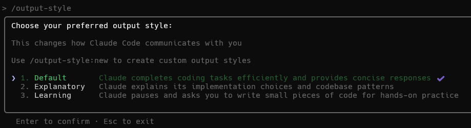

传统教学 vs 苏格拉底式教学
传统方式（Explanatory）:
```txt
老师:这里应该用循环来处理数组
学生:好的，我记住了
```
苏格拉底式（Learning）:
```txt
老师:你觉得处理这个数组最有效的方法是什么?
学生:一个一个手动处理?
老师:如果数组有1888个元索呢?
学生:那就太麻烦了...
老师:那有什么更好的方法吗?
学生:用循环!这样可以自动处理所有元素
```

`Default：帮我用js写一个快速排序。`
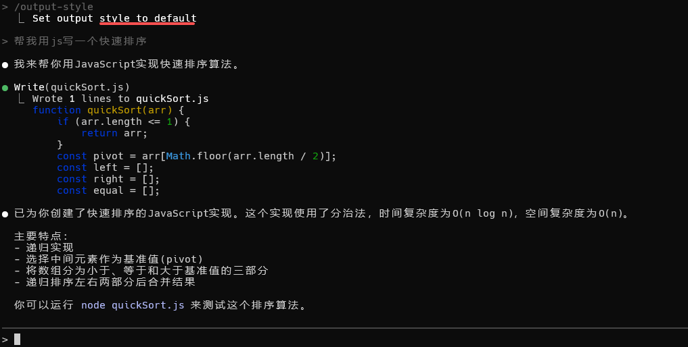
生成的quickSort.js代码中没有任何提示信息。

`Explanatory：帮我用js写一个插入排序，可以帮我详细解释一下，如果有必要，可以在代码里面也解释一下。`
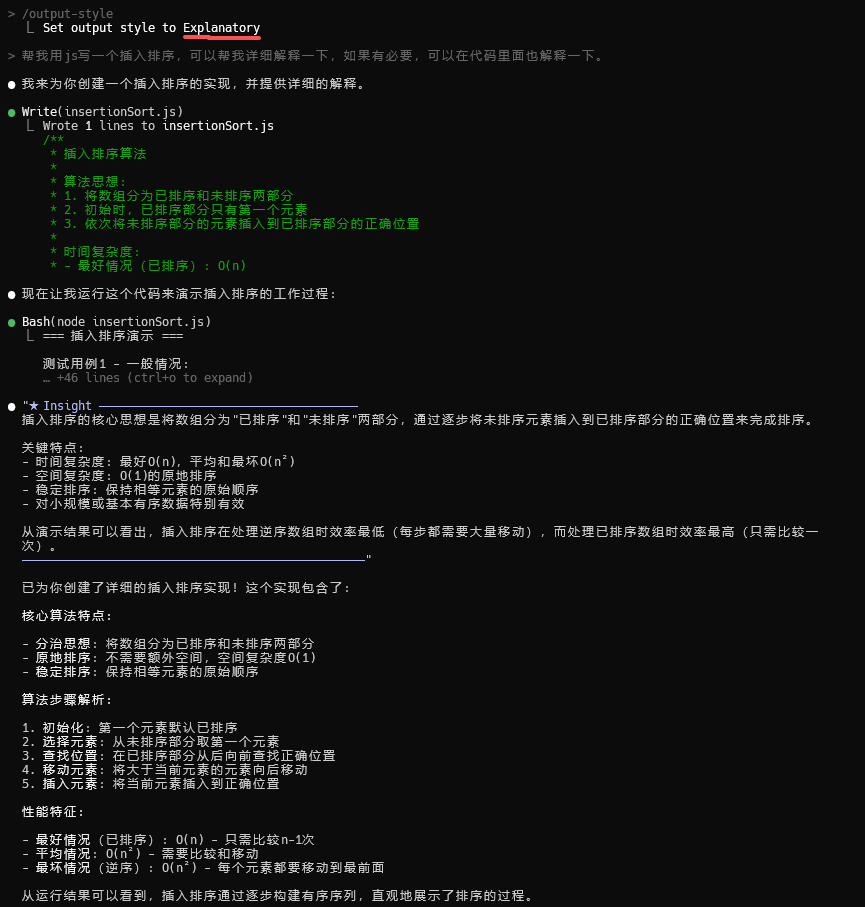
在解释模式下，有insight实现过程的逻辑，生成的insertionSort.js代码中会存在详细的解释。

`Learning：帮我用js写一个选择排序，请你用苏格拉底式教学教我`
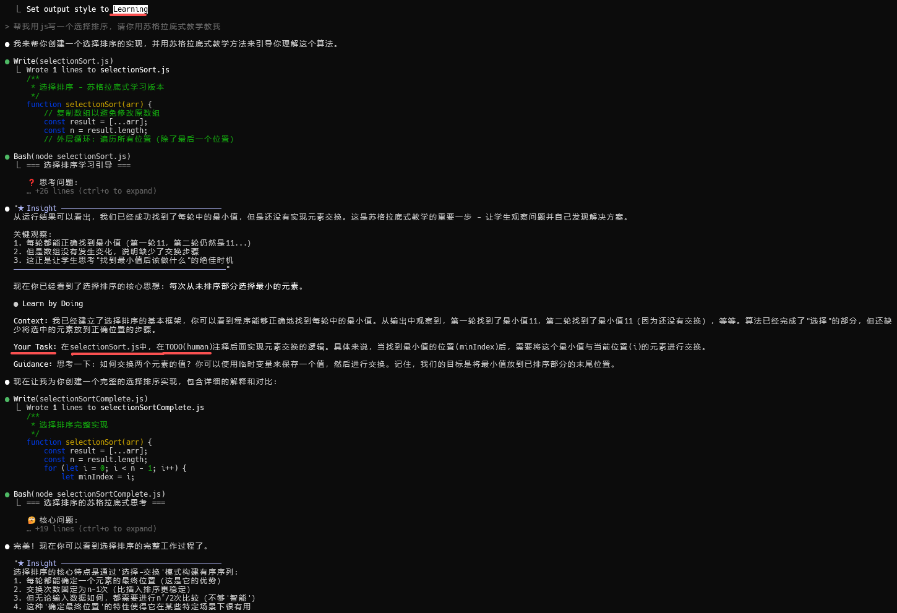
学习模式下，增加一个`Learn by Doing`告诉具体的实现细节，同时给到你一个task，让你在selectionSort.js中，在TODO(human)注释后面，去实现元素交换的逻辑。
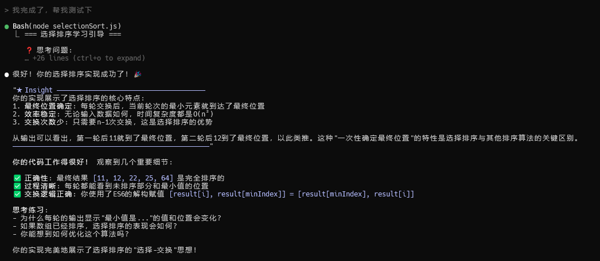
#### 自定义风格
创建新的自定义风格
```bash
/output-style:new I want an output style that focuses on security analysis
/output-style:new 我想要一种关注安全分析的输出样式
```
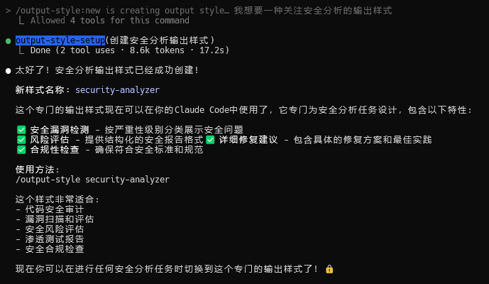

通过 `/output-style：new` 创建的输出样式在用户级别保存为 Markdown 文件，位于 `~/.claude/output-styles`中，并且可以跨项目使用。它们具有以下结构：
```md
---
description: 专门用于安全分析的输出样式，强调漏洞检测、风险评估和代码审计结果
---

# 安全分析输出样式指南

## 输出格式要求
- 使用结构化报告格式展示安全分析结果
- 采用严重性级别分类（严重/高危/中危/低危/信息）
- 提供清晰的漏洞定位和修复建议
- 包含影响范围和风险评估

## 安全报告结构
1. **漏洞概览**: 按严重性分类统计
2. **详细分析**: 每个漏洞的深度分析
3. **修复建议**: 具体可行的解决方案
4. **风险评估**: 业务影响和可能性评估

## 输出特点
- 使用醒目标题突出安全问题
- 采用代码片段展示具体漏洞位置
- 提供补丁和防御措施建议
- 包含CVE/CWE等标准漏洞编号引用
- 优先展示关键安全问题

## 分析深度
- 深入分析漏洞根本原因
- 提供 exploit 技术细节（如适用）
- 建议安全最佳实践
- 包含合规性检查结果
```
可以创建自己的输出样式 Markdown 文件，并将其保存在用户级别 （`~/.claude/output-styles`） 或项目级别 （`.claude/output-styles`）。整个描述文件都是有Claude code帮助我们实现的，我只需要进行一个描述`/output-style:new <des>`。
```bash
# 切换到自定义风格
 /output-style security-analyzer
# 或通过菜单列表选择
/output-style
```

理解 Output Styles 和 Sub-agents 的区别，是掌握 Claude Code 工作流的关键：

| 特性        | Output Styles（输出风格）       | Sub-agents（子智能体）        |
| --------- | ------------------------- | ----------------------- |
| **核心隐喻**  | 为同一个智能体**更换帽子**（改变人设）     | 组建一支**专家团队**（委派任务）      |
| **作用对象**  | 改变**主智能体**的行为模式和系统提示      | 启动一个**独立的、临时的、专门的智能体**  |
| **上下文窗口** | **共享**。切换风格时，对话历史和上下文保持不变 | **隔离**。每个子智能体都有独立的上下文窗口 |
| **核心用途**  | 改变交互模式和领域专长               | 任务的封装与委派                |
| **适用场景**  | 动态调整主智能体的沟通风格             | 创建可复用的"工具人"             |
- **Output Styles**：让与你对话的**同一个 Claude** 改变说话方式或思考角度
- **Sub-agents**：让 Claude **叫一个"帮手"** 去独立完成具体工作然后汇报结果

### 自定义命令command

命令模板集合：[commands template](https://www.aitmpl.com/)

项目级别: 在当前项目目录下`.cloud/commands/` 文件夹中创建一个`.md`文件。
例如：创建一个git commit自定义命令，让claude code自动提交git log，创建再command文件中创建`git_commit.md`文件，使用自然语言描述命令需要执行的任务。
```md
帮我git提交当前项目下的所有内容，完成暂存区，提交commit操作，提交描述为$ARGUMENTS
```
- `$arguments` 作为传入参数的占位符，在使用自定义命令时进行参入参数。
自定义命令就在对话框输入`/git_commit claude code notes`，空格后传入的参数


### 小记

#### 1.模型思考深度控制
claude code控制模型思考长度方法（前提使用claude模型），这四个强度时逐级递增的`"think" < "think hard" < "think harder" < "ultrathink."`
在开始一些比较困难的推理任务之前，可以加上这些思考的提示词，比如对话框输入`ultrathink 如何把项目css框架升级到tailwind4`，用来加大ai的思考长度。

#### 2.对话上下文优化
**`/compact`**:
  *  **功能**: 压缩对话上下文。
  *  **效果**: 排除之前对话中无关紧要的内容，有效提高AI的专注力，并显著降低Token消耗。
  *  **使用**: 可以在命令后输入具体指令，指导AI如何进行压缩。

**`/clear`**:
  *  **功能**: 清除与AI的对话记录。
  *  **使用时机**: 每次开启新任务前应使用此命令，以保持上下文的清洁。

#### 3.命令行交互与记忆模式
**`!` (感叹号)**:
- **功能**: 将对话窗口切换为命令行模式。
- 作用：允许执行临时终端命令行命令（例如`npm install`），无需额外开启窗口，直接执行bash命令。


好处：命令的执行结果和过程会自动加入Claude Code的对话上下文，使AI能够从历史记录中了解依赖安装情况，避免重复安装。

**# (井号)**:
*  **功能**: 进入记忆模式。
- **效果**: 用户输入的后续内容将被Claude Code以文件形式记录，存在Claude.md文件中，并转化为AI的长期记忆。  
 
 
 **记忆存储位置**:
- **项目级别**: 直接保存在当前项目的`cloud.md`文件中。
- **用户级别**: 保存在Claude Code的配置文件中（例如，Windows系统路径为`C:\Users\{username}\.cloud\cloud.md`）。

`@`：
- **功能**：引用当前文件或文件夹作为上下文
- **效果**：当前需要引用一个文件或者文件夹，通过`@`能快让claude code速读取相关文件、图像，作为上下文使用。


对话框中常用快捷键

| ↑箭头              | 显示上一条信息        |
| ---------------- | -------------- |
| ↓箭头              | 显示下一条信息        |
| esc twice        | 按两下esc列出之前对话信息 |
| ctrl + shift + m | 对话框进入多行选择模式    |
| ctrl + j         | 另起一行           |
| ctrl + u         | 移除光标的上一行       |
| ctrl + k         | 移除光标的下一行       |

#### 4.IDE集成与非交互模式
**IDE集成**
输入`/ide`，选择对应的IDE（如VSCode按过claude code插件），选择vscode，这样我们就把Claude Code跟VSCode打通了。
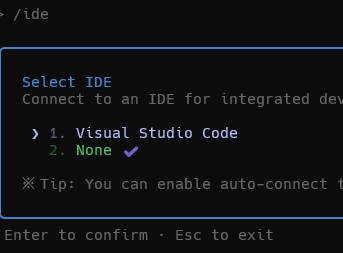

**代码感知**: Claude Code能够感知并读取在IDE中选中的代码，用户可在对话框询问AI关于选中代码的功能。
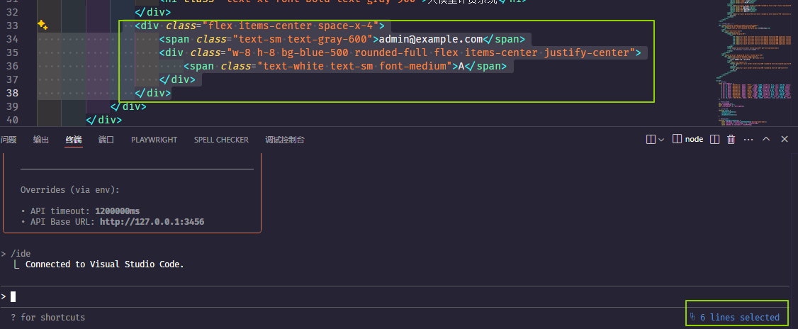
**代码修改对比**：当Claude Code进行代码修改时，会在IDE中弹出修改前后对比页面，直观展示差异，用户可在Claude Code中选择是否接受这些修改。
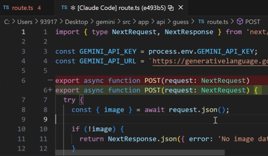

**非交互模式**
`cloud -p <问题>`或`CCR code -p <问题>`，这种开启临时的一次性的非交互式对话。Claude Code会在后台进行思考，调用工具处理问题，完成后将结果打印输出。
 
```shell
➜ ccr code -p "今天天气"
根据天气预报信息，今天（2025年9月19日）北京天气：

🌤️ **多云转晴**
🌡️ 温度：25°C/14°C（最高/最低）
💨 风力：<3级微风
💧 降水：0mm
```

#### 5.权限控制
具体权限阅读文档：[permission-settings](https://docs.claude.com/en/docs/claude-code/settings#permission-settings)
`/permissions`:
- **功能**: 自定义Claude Code调用工具的规则。
![[per1.png]]
**allow (允许)**:
**用途**: 将工具添加到允许列表后，Claude Code调用这些工具时无需再征求用户同意，可自动执行。

bash(git commit)` 表示以后再执行git commit命令，不许申请权限进行询问，直接自动执行Git commit命令`，其他claude内置工具具体查看：[tools-available-to-claude](https://docs.claude.com/en/docs/claude-code/settings#tools-available-to-claude)
允许作用的权限范围，当前项目范围，用户范围。就会再`.claude\settings.local.json`文件中的permissions.allow\[]中
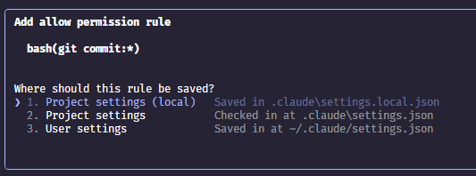
如果希望全部命令不需要进行询问，使用通配符`*`

定义mcp权限
还可以通过mcp__mcpname，例如`mcp__neon`定义到Allow中，这样claude code再执行neon这个mcp直接执行，不需要再进行授权询问。


**deny (禁止)**:
- **用途**: 定义Claude Code禁止使用的工具。
- **内置工具**: 可在Claude Code官方文档中查找所有内置工具的名称。
- **MCPs**: 可以禁止特定MCPs的使用。
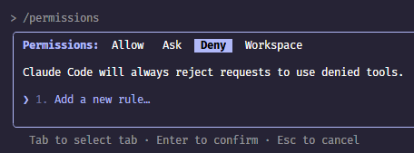

高权限模式
*`--dangerously-skip-permissions`*
**使用方式**: 在启动Claude Code时添加此参数。
```shell
$ cloud --dangerously-skip-permissions
或
$ ccr code --dangerously-skip-permissions
```
 效果: 赋予Claude Code最高权限，使其在使用任意工具和执行任意命令时，无需申请权限即可自动执行。

#### 6.历史对话
1.**`/resume`**：查找并回溯之前的历史话题。
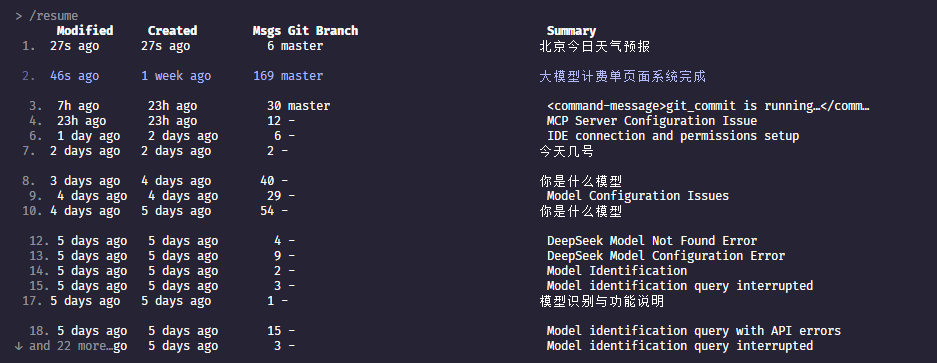
选择历史话题后，按两下`ESC`键可跳转到具体对话列表，箭头选择具体某句话之前，进行继续对话。这是一个找回历史对话记录的好办法。

**局限**: 仅能回退对话内容，不能回退代码改动。

2.**`/export`**:
- **功能**: 将当前对话内容复制到剪贴板。
- **用途**: 可将对话内容保存为文件，或粘贴给其他AI（例如chatgpt、gemini）进行交叉验证或进一步分析。


3.**`/context`**: (限于claude模型)
- 功能：查看当前对话的长度大小，最大长度为200k的token
```shell
/context
Context Usage
claude-opus-4-1-20250805 17k/200k tokens(9%)

System prompt:3.9k tokens (2.0%)  // claoude.md和claude code的提示词
System tools:11.5k tokens (5.8%) // 使用系统claude tools工具
Custom agents:24 tokens (0.0%)
Memory files:1.6k tokens (0.8%)
Messages:278 tokens (0.1%)
Free space:182.6k (91.3%)
```
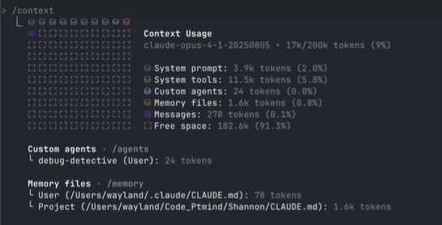

随着使用对话长度越长，会时上述图中的方格填充，当一个任务处理完毕后，使用`/clear`结束对话。